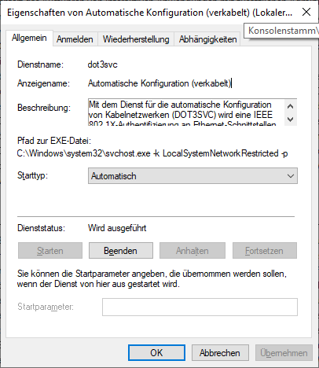

# Networking

<!-- panels:start -->
<!-- div:title-panel -->
## Radius

<!-- div:left-panel -->
### Missing Radius Auth Settings

This could be because the service "dot3avc" is not running.

> [!Note]
> The service display name can be quite exotic in different languages. Make sure to use the "services.msc" instead of the one embedded in the Task manager, as the ladder uses the display name, making it impossible to find.

### Disable Network Radius

To stop authentication via cable, this service can be stopped. This is sometimes needed, if the computer is in a foreign network and tries to authenticate.

<!-- div:right-panel -->

<!-- panels:end -->
